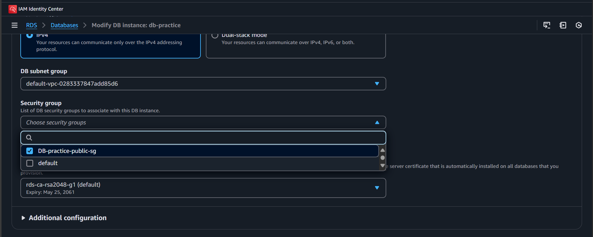

# AWS RDS

### Summary :

1. **Implementing RDS(MySQL)**
2. **Creating Custom Security Group for RDS Public Access**
3. **Modifying Created Security Group for RDS Private Access**
4. **Accessing RDS though EC2**


## Implementing RDS(MySQL)

### Description:

Creating RDS(MySQL) without any network rules and accessing it in MySQL Workbench.


#### RDS -> Database -> Create Database


1. **Standard Create**
2. **Select MySQL**
3. **Templates**: Used Free Tier
4. **Settings**: Give DB_name [Used db_practice]
5. **Credentials**: Master username (admin) / Master password
6. **Select VPC and VPC Groups**: Used Default VPC
7. **Connectivity**: Check Public Access to access DB publicly [MySQL Workbench (outside VPC)]
8. **Database Authentication**: Used Username and Password Authentication Only
9. **Create Database**

You can see the created database in the Databases dashboard


> After successful creation, **Endpoint link** will be generated. Use it for Hostname in MySQL Workbench for accessing the DB server .

> **MySQL Port Number: 3306**

Launch MySQL-Workbench and try to make a connection 


We couldn't make a successful connection because database is publicly accessible, but the VPC security group does not allow this because there are no permissions set for public access.To resolve this, we need to update the VPC security group policies to grant the necessary permissions.

> **VPC security group's** : Provides rules for inbound and outbout traffic

## Security Group Setup for Public Access

### Description:

Creating a Custom VPC security group for DB-server to access it publicly. Change the inbound and outbound rules to `0.0.0.0/0`, which makes it publicly accessible.

#### Steps:
1. Create Security Group

2. Select the VPC where the DB is created


3. Change the Inbound and Outbound rules and save it


4. Navigate : RDS -> Databases -> Modify DB Instance: db-practice
   - Remove Default Security Group
   - Check the newly created Security Group
   - Save



5. Go to MySQL Workbench and connect again


After successful connection, you can enter queries to create or modify the database.


> **Security Concern**: Since inbound/outbound rules are set to `0.0.0.0/0`, any IP (public or private) can send and receive data from the DB server, raising security risks.

## Private Access - DB Server

To avoid security concerns we need to restrict access to only specific systems. So, we allow only known IP’s in the inbound/outbound rules. Now, we are only going to allow MySQL Workbench system to access the DB server. So, for that we are going to modify the rules in security group

#### Steps:
1. Get the public IP of MySQL-workbench system from [WhatIsMyIP](https://www.whatismyip.com/).
2. Navigate to the created Security Group in VPC 
3. Add the public IP under inbound/outbound rules and remove the `0.0.0.0/0` rule.


> Apart from this IP, no one can send and receive data.

## Accessing DB Server from EC2

### Description:
To access the DB server within AWS, we need a virtual server (EC2 instance) that acts as a bridge for secure database access.

#### Steps:
1. Navigate to EC2


2. Launch Instance:
   - **Name**:[Server-name]
   - **OS**: Ubuntu
   - **Instance Type**: Used free tier (t3.micro)
   - **Create Key Pair for ssh connection**
   
   
   - **Network Settings**: Select the VPC which is used for DB server and check SSH, HTTPS, and HTTP
   
   - **Save Instance**


3. Connect to the Instance:


4. Install the required packages:
```sh
sudo apt install mysql-client

#this code is used to connect to MySQL-Client
mysql -h <endpoint> -P <port> -u <username> -p

Example:

mysql -h db-practice.xxxxxxxxxxx.amazonaws.com -P 3306 -u admin -p
```

> **Important**: Before connecting from EC2, add the **private IP of EC2** to the DB server's inbound/outbound rules, as both are under the same VPC.


Established successful connection with DB server


<h1 style="text-align: center;">நன்றி வணக்கம் 🙏</h1>

